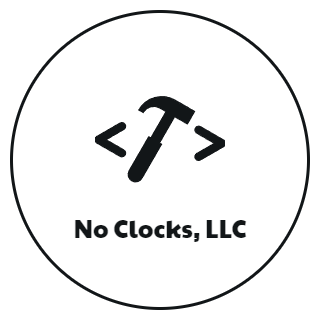

  

# No Clocks Brand Guide

> [!NOTE]
> This repository is still a *work in progress*.

## Table of Contents

- [Overview](#overview)
- [Design System](#design-system)
- [Assets](#assets)

## Overview

This repository contains the brand guide for No Clocks, LLC. It includes the design system and assets used to create the brand identity.

## Design System

The design system is a collection of reusable components, guided by clear standards, that can be assembled together to build any number of applications. It includes the following:

...

## Assets

The assets are the visual elements that make up the brand identity. They include the following:

...

### Logo

The logo is the primary visual representation of the brand. Typically, a logo contains both a graphic element and a text element that work together to create a unique and recognizable mark. The logo is used across various applications, such as websites, business cards, and promotional materials.

The following variations of the logo are available:

- **Main (Primary, Default)**: The main logo version used in most applications. At a minimum, should have a `png` and `svg` format.

- **Alternative (Secondary, Inverse)**: An alternate version of the logo used in specific contexts or applications. May have different color schemes, layouts, or graphic elements.

- **Icon (Symbol, Mark)**: A simplified version of the logo that consists of only the graphic element. Used in small spaces or as a favicon.

| Variation   | Preview                                                                                |
|-------------|----------------------------------------------------------------------------------------|
| Main        |             |
| Alternative |  |

### Icon

| Icon |  |

### Color Palettes

The color palette is a set of colors that are used consistently across all brand materials. It includes primary, secondary, and accent colors that work together to create a cohesive and visually appealing brand identity.

The following color palettes are available:

- **Default (Primary)**: The default color palette used in most applications. It consists of a primary color, secondary color, and accent color.

- **Light and Dark Mode Schemes**: Color palettes optimized for light and dark mode applications. They include color combinations that are legible and visually appealing in different lighting conditions.

- **Monochrome/Grayscale Scheme**: A color palette consisting of monochrome-based shades of gray that can be used in black-and-white or grayscale applications.

#### Default Palette

|   Color   |    Hex    |       RGB       |                             Preview                             |
|:---------:|:---------:|:---------------:|:---------------------------------------------------------------:|
| Gunmetal  | `#222831` |  `34, 40, 49`   |   |
| Jetblack  | `#353535` |  `53, 53, 53`   |   |
|   Onyx    | `#393E46` |  `57, 62, 70`   |       |
|  Indigo   | `#284B63` |  `40, 75, 99`   |     |
| Caribbean | `#3C6E71` | `60, 110, 113`  |  |
|  Nyanza   | `#CEE6CD` | `206, 230, 205` |     |
| Tea Green | `#C3F3C0` | `195, 243, 192` |  |
| Platinum  | `#D9D9D9` | `217, 217, 217` |   |
|   White   | `#FFFFFF` | `255, 255, 255` |      |

#### Monochrome Palette

|    Color    |    Hex    |       RGB       |                              Preview                              |
|:-----------:|:---------:|:---------------:|:-----------------------------------------------------------------:|
|    Black    | `#000000` |    `0, 0, 0`    |        |
|   Darkest   | `#333333` |  `51, 51, 51`   |      |
|   Darker    | `#444444` |  `68, 68, 68`   |       |
|    Dark     | `#666666` | `102, 102, 102` |         |
| MediumDark  | `#999999` | `153, 153, 153` |   |
|   Medium    | `#DDDDDD` | `221, 221, 221` |       |
| MediumLight | `#EEEEEE` | `238, 238, 238` |  |
|    Light    | `#F3F3F3` | `243, 243, 243` |        |
|   Lighter   | `#F8F8F8` | `248, 248, 248` |      |
|  Lightest   | `#FFFFFF` | `255, 255, 255` |     |
|    White    | `#FFFFFF` | `255, 255, 255` |        |

***

[No Clocks, LLC](https://github.com/noclocks) | 2024
