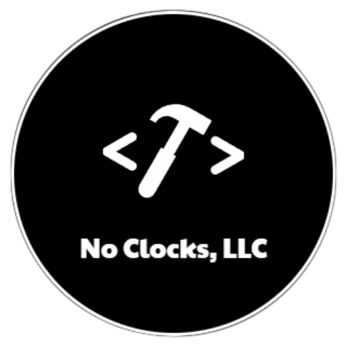

  

# No Clocks Brand Guide

> [!NOTE]
> This repository is still a *work in progress*.

## Table of Contents

- [Overview](#overview)
- [Design System](#design-system)
- [Assets](#assets)

## Overview

This repository contains the brand guide for No Clocks, LLC. It includes the design system and assets used to create the brand identity.

## Design System

The design system is a collection of reusable components, guided by clear standards, that can be assembled together to build any number of applications. It includes the following:

...

## Assets

The assets are the visual elements that make up the brand identity. They include the following:

...

***

[No Clocks, LLC](https://github.com/noclocks) | 2024
