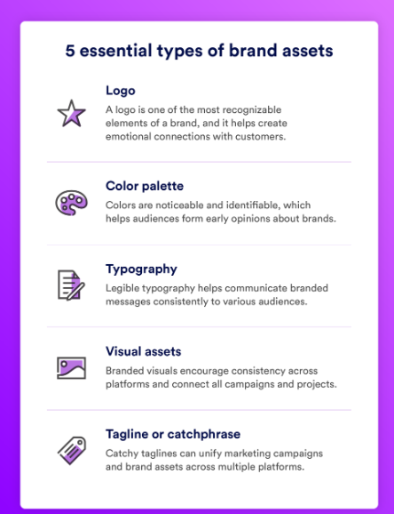

# Brand Assets

> [No Clocks, LLC](https://github.com/noclocks) brand assets.

## Contents

## What are Brand Assets?

> The McDonald's golden arch is one of the most recognizable brand elements in history, rivaled only by other iconic assets like Nike's catchphrase, Amazon's packaging, and Coca-Cola's red. These brand assets are easily identifiable and encourage audiences to quickly recall specific brand names associated with them.
>
>But what is a brand asset? Our in-depth guide covers what brand assets are, why they're important, the different types of brand assets, best practices to follow for successful creation, utilization, and implementation of these assets, and more.

A **Brand Asset** is an identifiable branded element easily connected to a company's identity.

There are various types of brand assets, but some of the most common include:

- Company Logo(s)
- Colors, Color Schemes, and Color Palettes
- Fonts (Typography)
- Icons
- Visual Assets
- TagLines

Brand assets are especially important for brand differentiation and association. Your customers should be able to quickly pick out your brand assets when they're compared to your competitors' brand assets, even with similarities like coloring, catchphrases, or sound bites. These elements can also help companies understand and prioritize brand positioning, which can strengthen a brand's messaging and user experience.

## Brand Assets vs. Digital Assets

Brand assets and *digital assets* are different, but only slightly. Digital assets are any digital files your brand has the right to use for any purpose, while brand assets are elements specifically used to convey a brand's identity rather than its users, target audience, or stakeholders. Brand assets can be digital assets, but not all digital assets are classified as brand assets, especially those used for special marketing campaigns or influencer projects. Brand assets are specifically used to convey the identity of the brand rather than its users, target audience, or stakeholders.

## Types of Brand Assets

While there are four essential types of brand assets, there are a variety of other unique elements companies can adopt for their brand. Not every company needs to use every asset — they can be individualized based on a brand's needs.

### Brand Name

A [brand name](https://brandfolder.com/resources/top-5-creating-unique-brand-name/) is pretty straightforward: It's your brand's identifier, and it should be catchy, unique, and easy to remember. Powerful brand names typically stick to a single brand style or naming convention, which could include:

-   A founder's first or last name
-   An acronym
-   A description of a product or service

While it's not required for brands to follow these naming suggestions, iconic companies like Dell, Microsoft, IBM, Cadbury, Ferrari, ABC, and many others have successfully applied these styles and cemented themselves as successful brand names.

**Brand Example:** CVS is an easily recognizable drug store and brand name. The company officially entered the market as the [Consumer Value Store](https://www.cvshealth.com/about/our-strategy/company-history.html) in 1963 and transitioned to CVS in 1964, nearly doubling in size eight years later.

### Logo

### Color Palette

### Tagline, Slogan, or Catchphrase

### Typography

### Iconography

### Photography

### Illustrations

### Infographics

### Website

### User Interface (UI) Elements

### User Experience (UX) Elements

### Data Visualizations

### Brand Voice

### Merchandise

### Product Packaging

### Email Templates

### Social Media Templates

### Blog Templates

### Presentation Templates

### Business Cards

### Letterhead

### Social Assets

### Print Materials

### Signage

### Animation

### Video

### Mascot

### Sound Effects, Music, Jingles

- Logo:
  - `noclocks-logo-full-padded (1000x1000).png`
  - Variants:
    - Web (all `3163x461` pixels):
      - `noclocks-logo-wide-black-transparent.png`
      - `noclocks-logo-wide-white-transparent .png`
      - `noclocks-logo-wide-white-bg.png`
      - `noclocks-logo-wide-black-bg.png`
    - Print (all `3163x461` pixels):
