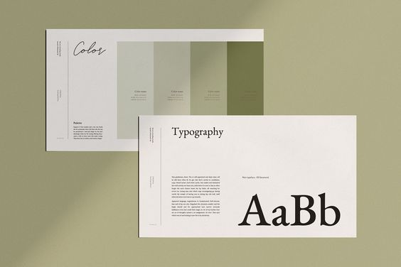
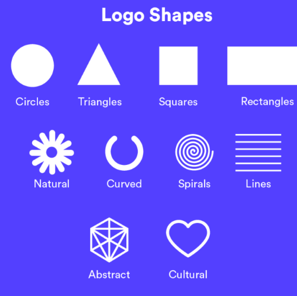
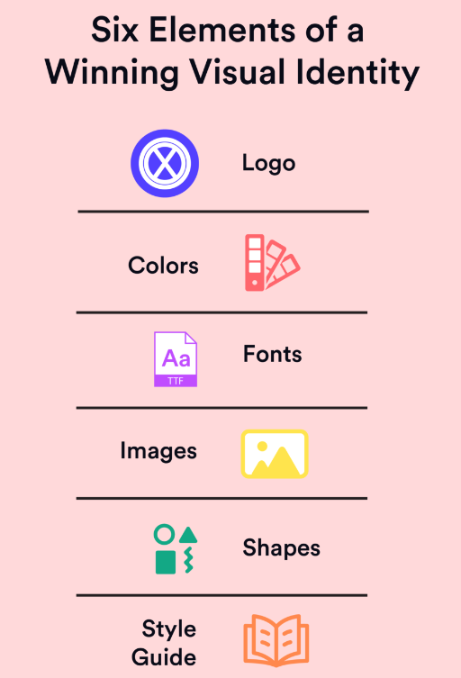

# Visual Identity

> **Visual Identity** is a set of elements that help customers identify and differentiate a brand from others.

## Contents

## Overview

This is the visual identity of the brand.

It includes, but is not limited to:

- Logo
- Fonts (Typography)
- Colors (Color Palette)
- Graphics
- Websites
- Animations
- Social Media Profiles and Posts
- Merchandise
- Storefronts
- Packaging
- Signage
- Business Cards
- Presentations
- Email Signatures

and other visual elements that make up the brand's visual identity.

## Visual vs. Brand Identity

> If **brand identity** is the personality of the brand, **visual identity** is the face of the brand.

**Visual Identity** is a subset of **Brand Identity** that focuses on the visual elements of the brand. It includes the logo, colors, fonts, graphics, imagery, and overall style. It's what you see first.

**Brand Identity** is the holistic concept, or framework of the brand, similar to its personality. It includes the brand's visual, linguistic, and strategic elements which when combined with content such as values, mission, voice, and tone create the brand's identity.

## Elements for Visual Identity Success

### Logo

The logo is the most recognizable element of the brand. It should be simple, memorable, and versatile. It should work in different sizes, colors, and mediums.

### Fonts (Typography)

The fonts used in the brand's visual identity should be consistent and reflect the brand's personality. They should be easy to read and work well in different sizes and mediums.

Fonts embody the brand's personality: minimalistic, modern, vintage, fun, romantic, professional, etc.  So it's crucial to ensure the brand's typography complements its other elements to maintain the integrity of your brand's personality.

### Colors (Color Palette)

Colors communicate almost instantly. A company’s color palette spreads across different visual elements like storefronts, packaging, websites, marketing ads, or social media posts. So a brand’s color choice should be well-thought-out.

Consider the meaning, cultural connotations, and versatility of colors from various visual elements before selecting.  A company’s color palette includes a primary color from its logo and secondary colors for background and accents. Strong brands use colors so consistently that it creates a sense of ownership over the color.

### Graphics (Imagery)

Imagery includes a brand’s choice of photos, videos, illustrations, icons, and graphics. In the age of Instagram posts and Tiktok reels, images aren’t just supplemental. They have become central to how the audience perceives the brand.

The color, composition, aesthetics, and style of imagery go a long way in defining brand identity.

Whether you use stock images or create your photos in-house, the images should be consistent with your style. Creating a [style guide](./guide.md) or preset for your imagery is a great way to keep it in tune.

### Shapes and Patterns

Using shapes and patterns consistently is essential for creating continuity throughout your visual aids. Product packaging, posters, and marketing materials are places you can show off your brand’s shapes and patterns.

### Style Guide

Creating a coherent brand might feel like madness, but there is a method to it!

A complete style guide for all your visual elements usually includes rules on how to use those visual elements. Here are some key elements that a style guide covers:

- **Logo** – variations, size, placements
- **Typography** – typeface, fonts, size, spacing
- **Color Palette**
- **Icons**
- **Imagery Styles**
- **Web-Specific Elements**
- **Rules, guidelines, and templates** for designing all visual elements

Creating a visual style is a time-consuming process. But the results that come from putting in the work from the beginning are worth it.

