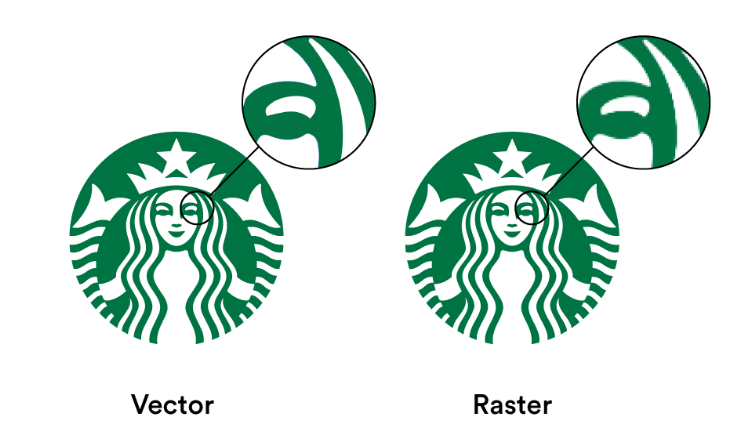

# Extensions

> *Extensions in this context refers to the actual file extension of an image file.*

When it comes to logos, icons, and other visual assets, the file extension is an important part of the file name. The file extension determines the format of the image and can affect the quality, compatibility, and performance of the image.

## Common Extensions

- **PNG**: Portable Network Graphics
- **JPG** or **JPEG**: Joint Photographic Experts Group
- **GIF**: Graphics Interchange Format
- **SVG**: Scalable Vector Graphics
- **WEBP**: Web Picture
- **AVIF**: AV1 Image File Format
- **ICO**: Icon
- **PDF**: Portable Document Format

## Rare Extensions

On rare occasions, we may also use the following file extensions:

- **TIFF**: Tagged Image File Format
- **BMP**: Bitmap Image File
- **EPS**: Encapsulated PostScript
- **PSD**: Photoshop Document
- **AI**: Adobe Illustrator
- **INDD**: Adobe InDesign Document
- **CDR**: CorelDRAW Image File
- **SKETCH**: Sketch File

## Choosing the Right Extension

The file extension should be chosen based on the intended use of the image and the compatibility with the software or platform where the image will be displayed.

For example, if the image is intended for use on a website, the `PNG` or `WEBP` format may be preferred due to their support for transparency and compression. If the image is intended for print, the `PDF` or `TIFF` format may be preferred for high-quality output.

## Example

Applying the naming conventions mentioned above, here is an example of a logo with various types, color schemes, dimensions, and extensions:

- Full Logo with both the logo mark and logotype combined
- Full Color
- High-Resolution Vector Format
- Transparent Background

```text
noclocks-fulllogo-fullcolor-highres-transparent.svg
```

In this example:

- `noclocks`: Company name
- `fulllogo`: Type of logo
- `fullcolor`: Color scheme
- `highres`: High resolution
- `transparent`: Transparent background

## Vector vs. Raster

When choosing an extension for an image, consider whether the image is a vector or raster image.



All logo file formats will be either a raster or a vector file.

- **Raster** files are high-quality digital images that are made of pixels. Raster files lose quality as they scale.

- **Vector** files are images made of a multitude of lines and points that can be edited in design programs. They maintain quality as they scale.

## Usage Guidelines

**For Uploading Online**: Use `PNG` for uploading our logo to a website, social media, banners, profile pictures, and invoices. Rarely we will use `WEBP` instead of `PNG` for better compression.

**For Print or Editing**: Use `SVG` logo file format to send our logo to be printed on business cards, brochures, shirts, stickers, or other printed materials. `PDF` is also acceptable for print. Rarely we will use `AI` or `EPS` instead of `SVG` for better compatibility with design software.

**For Icons**: Use `SVG` for icons that will be used on websites, apps, or other digital platforms. `ICO` is also acceptable for Windows icons. Rarely we will use `PNG` instead of `SVG` for better compatibility with older browsers.

**For Photos**: Use `JPG` for photos that will be uploaded to a website or shared online. `TIFF` is also acceptable for high-quality photos. Rarely we will use `WEBP` instead of `JPG` for better compression.

**For Animations**: Use `GIF` for simple animations that will be uploaded to a website or shared online. `WEBP` is also acceptable for animations. Rarely we will use `AVIF` instead of `GIF` for better compression.

**For Favicon**: Use `ICO` for favicons that will be used on websites. `PNG` is also acceptable for favicons. Rarely we will use `SVG` instead of `ICO` for better compatibility with modern browsers.

## Cheatsheet

| File Extension | Benefits | Use Cases | Compatibility | Quality | Performance |
| :---: | :---: | :---: | :---: | :---: | :---: |
| **PNG** | Raster File, Transparency, Lossless Compression, Full Color | Digital: Websites, Social Media, Online Store, Banners, Invoices | Web, Print | High | Good |
| **JPG** or **JPEG** | Raster File, Lossy Compression, Full Color | Digital: Websites, Social Media, Online Store, Banners, Invoices | Web, Print | Medium | Good |
| **GIF** | Raster File, Animation, Transparency, Lossless Compression | Digital: Websites, Social Media, Online Store, Banners, Invoices | Web | Low | Good |
| **SVG** | Vector File, Scalable, Editable, Transparency | Digital: Websites, Apps, Online Store, Banners, Invoices | Web, Print | High | Good |
| **WEBP** | Raster File, Transparency, Lossy Compression, Full Color | Digital: Websites, Social Media, Online Store, Banners, Invoices | Web | High | Better |
| **AVIF** | Raster File, Transparency, Lossy Compression, Full Color | Digital: Websites, Social Media, Online Store, Banners, Invoices | Web | High | Best |
| **ICO** | Raster File, Icon, Scalable, Editable | Digital: Websites, Apps, Online Store, Banners, Invoices | Web | Low | Good |
| **PDF** | Vector File, Scalable, Editable, Print | Print: Business Cards, Brochures, Shirts, Stickers | Print | High | Good |
| **TIFF** | Raster File, High Quality, Lossless Compression, Full Color | Print: Business Cards, Brochures, Shirts, Stickers | Print | High | Good |
| **EPS** | Vector File, Scalable, Editable, Print | Print: Business Cards, Brochures, Shirts, Stickers | Print | High | Good |
| **AI** | Vector File, Scalable, Editable, Print | Print: Business Cards, Brochures, Shirts, Stickers | Print | High | Good |


## Conclusion

Choosing the right file extension is crucial for the quality, compatibility, and performance of an image. By following the guidelines mentioned above, you can ensure that your images are optimized for their intended use and platform.

At No Clocks, LLC, we typically use `PNG` and `SVG` for our logos. However, we may also use other file extensions based on the specific requirements of the project.


## References
