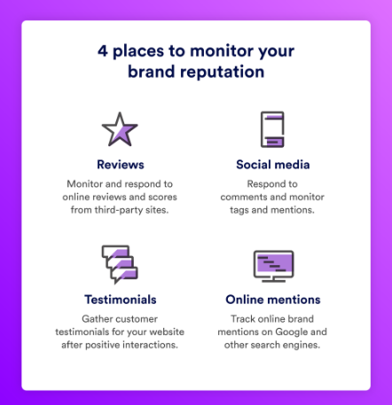

# Brand Reputation

## Contents

- [Overview](#overview)
- [Brand Reputation Monitoring](#brand-reputation-monitoring)
  - [Reviews](#reviews)
  - [Social Media](#social-media)
  - [Testimonials](#testimonials)
  - [Online Mentions](#online-mentions)

## Overview

A positive brand reputation is essential to a successful brand image. Maintain your brand's reputation by prioritizing the customer experience, consistently delivering high-quality products or services, and keeping tabs on how your audience feels about your brand.

Think of the last time you went out to eat or were thinking about making a purchase. You more than likely looked at the reviews or checked social media before you made a final decision.

Brand reputation management involves monitoring how your target audience views your brand, analyzing customer feedback, and building a connection with your audience to maintain your brand image. But how do you monitor your brand reputation?

## Brand Reputation Monitoring

There are four primary ways to monitor your brand reputation:

- Reviews
- Social Media
- Testimonials
- Online Mentions

With continuous monitoring, you’ll be able to tweak your strategy to uphold a positive brand reputation.

### Reviews

Reviews are typically posted to third-party sites and contribute to your business's overall rating. Monitoring online reviews is an important part of reputation management because it gives you an honest glimpse into what customers think of your service or products. Not every review will be a positive one, and that's okay! Responding to negative reviews effectively is crucial to maintaining a positive reputation.

### Social Media

Online presence makes a big impact on brand reputation. You can monitor comments on your brand's social media accounts, as well as mentions and tags. Social media is also a great place to connect with your audience to establish brand trust and loyalty.

### Testimonials

Testimonials are similar to reviews, but you can usually collect them from past customers to post on your website. If your brand has a positive interaction with a customer, leverage it by asking them for a testimonial to strengthen your brand reputation.

### Online Mentions

Utilize tracking tools that alert you whenever Google or other search engines find new mentions of your brand. This is another way to monitor how your brand is being perceived so you can stay in the know.
